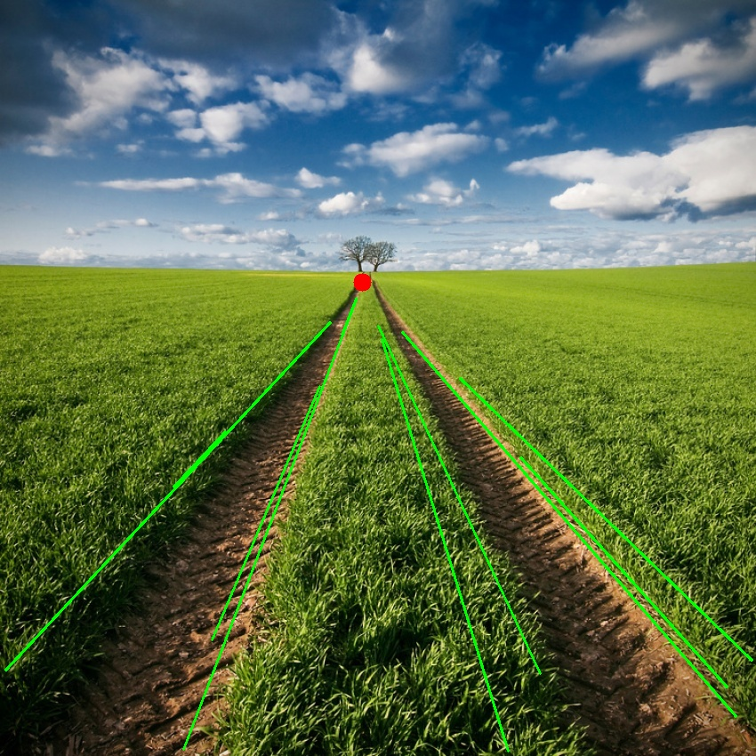

# Dependency

To run these programs successfully, you must have the following packages installed:

- Python (3.x recommended)
- OpenCV (cv2)
- NumPy
- Matplotlib

# Binarization Program

Perform image binarization using a histogram-based thresholding technique, offering both automatic and manual tuning.

## Introduction

Image binarization separates objects or regions of interest from the background by finding an optimal threshold.

## Key Features

- **Loss Function**: The `get_loss` function calculates a loss function, considering histogram values, bin values, and threshold.
- **Finding the Best Threshold**: The `get_best_thresh` function finds the best threshold value for binarization in either 'Auto' or 'Manual' mode.
- **Applying Threshold**: The `apply_thresh` function generates a binary image with values of 0 or 255.

## Usage

### Command Line

Use the following command line arguments:

- `-i` or `--img_path`: Input image path.
- `-t` or `--tuning_method`: Choose 'Auto' or 'Manual' tuning.
- `-u` or `--under_tuning`: Set tuning value for pixels under the threshold (only for 'Manual' tuning).
- `-o` or `--over_tuning`: Set tuning value for pixels over the threshold (only for 'Manual' tuning).
- `-s` or `--storing_path`: Output image path.
- `-show_all`: Set to 'False' only for serial script execution of multiple images.

### Graphic User Interface (GUI)

To use the GUI, run:

```bash
python binarization_GUI.py
```


## Examples

These are some examples of the program's output:


## SSIM computation

Comparing the binarization program with Otsu's method, the SSIM index was computed for each image. The results are shown below:


As expected the SSIM index is low, meaning that the two methods produce different results.
However, despite the simplicity of the implemented algorithm, it performs visually well.

# Vanishing Point and Lines Detection Program

This program is designed to detect vanishing points and vanishing lines within images. It's implemented in Python and organized into multiple scripts, each dedicated to a specific aspect of the task.

## Key Features

The program's functionality is divided into four main stages:

1. **Preprocessing**: Converts the input image to grayscale and reduces noise to enhance clarity and reduce artifacts.
2. **Edge Detection**: Identifies significant transitions in intensity within the image using the Canny edge detector.
3. **Lines Detection**: Detects straight line segments within the image using the probabilistic Hough transform.
4. **Vanishing Point Detection**: Identifies the vanishing point and vanishing lines within the image using the RANSAC algorithm.

## Command Line Usage

The program accepts several command line arguments, allowing you to customize its behavior for different images or use cases. You can choose between 'Auto' and 'Manual' tuning for edge detection and specify other parameters.
Use the following command line arguments:

- `-h` or `--help`: show the help message and exit.
- `-p` or `--path`: Specify the path to the input image or a folder containing images for batch processing.
- `-t` or `--tuning_method`: Choose the tuning method, either 'Auto' or 'Manual.'
- `-l` or `--lowThreshold`: Set the low threshold for the Canny edge detector (only for 'Manual' tuning).
- `-r` or `--highThreshold`: Set the high threshold for the Canny edge detector (only for 'Manual' tuning).
- `-a` or `--theta`: Set the theta value for the Hough transform (only for 'Manual' tuning).
- `-d` or `--threshold`: Set the threshold value for the Hough transform (only for 'Manual' tuning).
- `-m` or `--minLineLength`: Set the minimum line length for the Hough transform (only for 'Manual' tuning).
- `-g` or `--maxLineGap`: Set the maximum line gap for the Hough transform (only for 'Manual' tuning).
- `-s` or `--storingPath`: Specify the path to store the output image + name.
  For example, for 'Auto' tuning:

```bash
python vanishingPointDetection.py -p [input_path] -t Auto -s [output_path]
```

## Examples

```bash
    python3 vanishingPointDetection.py -p ../Images/vanishing_points/van_points8.jpeg -t Auto -s ../Images/examples/van_points8.jpeg
```


```bash
    python3 vanishingPointDetection.py -p ../Images/vanishing_points/van_points8.jpeg -t Auto -s ../Images/examples/van_points8.jpeg
```



# Additional details

Further information about the implementation and results of this project can be found in the [Report](report/computer_vision_project.pdf)
