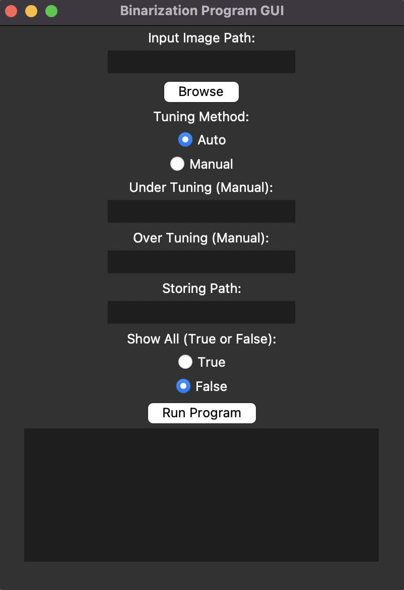
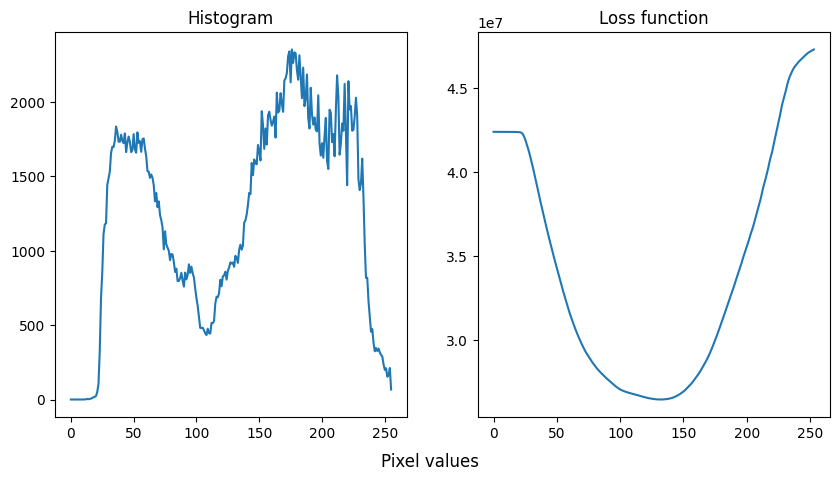
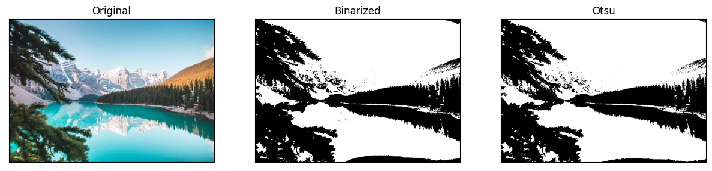
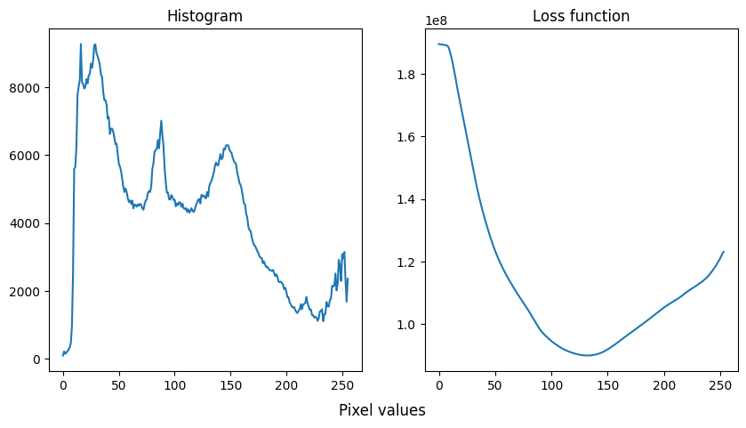
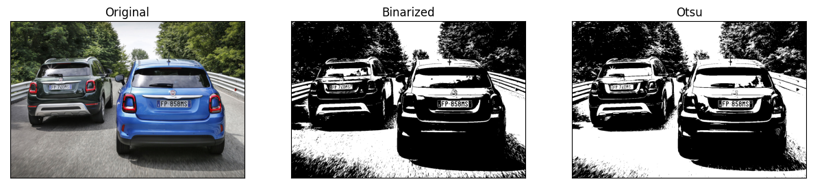
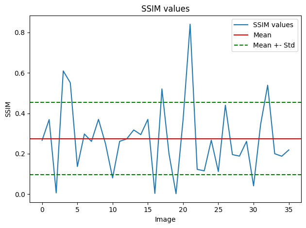

# Binarization Program

This program is designed to perform image binarization using a specifically designed Histogram based thresholding technic. It offers both automatic and manual tuning methods to determine the optimal threshold for converting a given image into a binary image.

## Introduction

Image binarization is a common image processing technique used to separate objects or regions of interest from the background. The goal is to find an optimal threshold value that divides the pixel values into two classes: foreground and background. 

## Reasoning Behind the Program

The program aims to find the best threshold value minimizing a loss function. Specifically,
a loss is computed for each possible value of the threshold and the minimum is selected.  Additionally, this program provides an option for manual tuning, allowing users to adjust the threshold values to suit their specific needs.

## Functions Explanation

### Loss Function

The `get_loss` function calculates a loss function based on the provided parameters, such as the histogram values, bin values, threshold, tuning method, and tuning values. The loss function is the following:\


$
L = \sum_{i=0}^{T} {num}_{i} \cdot {dist\_under\_thresh}_{i} + \sum_{i=T+1}^{255} {num}_{i} \cdot {dist\_over\_thresh}_{i}
$


where:
* **num**: Histogram values.
* **bin**: Bin values of the histogram.
* **T**: Threshold value for binarization.

If the tuning method is 'Auto', the distance is calculated as:

$
\text{\textbf{IF } {mean} > 128 \textbf{ THEN }} {dist\_over\_thresh} = {dist} + {tuning\_value}
$\
$
\text{\textbf{IF } {mean} < 128 \textbf{ THEN }} {dist\_under\_thresh} = {dist} + {tuning\_value} 
$

where:
* ${tuning\_value} = |255 - {mean}|$
* **dist**: Distance between the threshold and the bin value.

If the tuning method is 'Manual', the tuning value is inserted by user and divided in two:
* **under_tuning**: Tuning value for pixels under the threshold.
* **over_tuning**: Tuning value for pixels over the threshold.

The distance is calculated as:

$
{dist\_over\_thresh} = {dist} + {under\_tuning\_value}
$\
$
{dist\_under\_thresh} = {dist} + {over\_tuning\_value} 
$

### Finding the Best Threshold

The `get_best_thresh` function finds the best threshold value for binarization. It can operate in either 'Auto' mode, which automatically determines the optimal threshold, or 'Manual' mode, where users can specify under-tuning and over-tuning values. This function returns the best threshold value and the corresponding minimum loss value. It also offers the option to plot the loss function for analysis.

### Applying Threshold

The `apply_thresh` function applies the calculated threshold to the given image. It returns a binary image with values of 0 or 255, where 0 represents the background and 255 represents the foreground.

## How to Use from Command Line

The program accepts the following command line arguments:

- `-i` or `--img_path`: Specify the path to the input image + name.
- `-t` or `--tuning_method`: Choose the tuning method, either 'Auto' or 'Manual.'
- `-u` or `--under_tuning`: Set the tuning value for pixels under the threshold (only for 'Manual' tuning).
- `-o` or `--over_tuning`: Set the tuning value for pixels over the threshold (only for 'Manual' tuning).
- `-s` or `--storing_path`: Specify the path to store the output image + name.
- `-show_all`: Set to 'False' only for serial script execution of multiple images.

For 'Auto' tuning method:

```bash
python binarization.py -i [path_to_input_image] -t Auto -s [path_to_output_image] -show_all True 
```

For 'Manual' tuning, you can use the following command:

```bash
python binarization.py -i [path_to_input_image] -t Manual -u [under_tuning_value] -o [over_tuning_value] -s [path_to_output_image] -show_all True
```

## How to Use with a GUI
The program is also provided with a basic Graphic User Interface (GUI) that allows users to select the input image, tuning method, tuning values and storing path. The GUI also displays the loss function and the resulting binary image. To run the GUI, simply run the following command in the program directory:

```bash
python binarization_GUI.py
```


## Examples
These are some examples of the program's output:






## SSIM computation
Comparing the binarization program with Otsu's method, the SSIM index was computed for each image. The results are shown below:



As expected the SSIM index is low, meaning that the two methods produce different results.
However, despite the simplicity of the implemented algorithm, it performs visually well.

